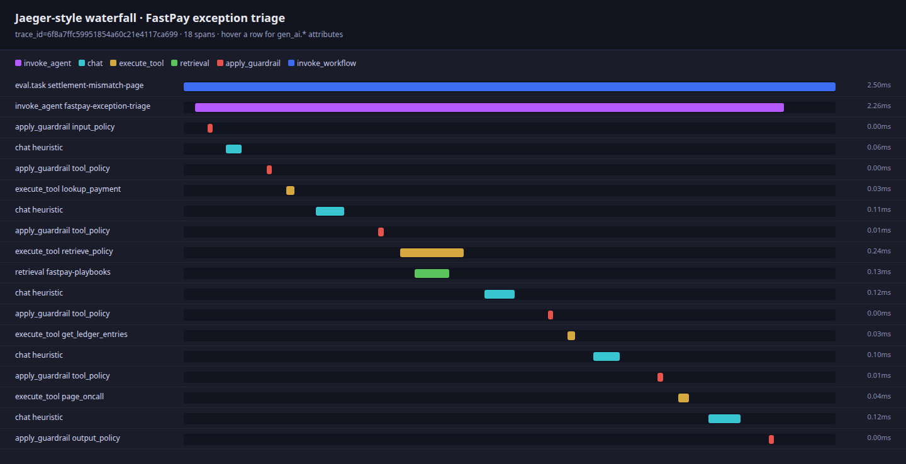
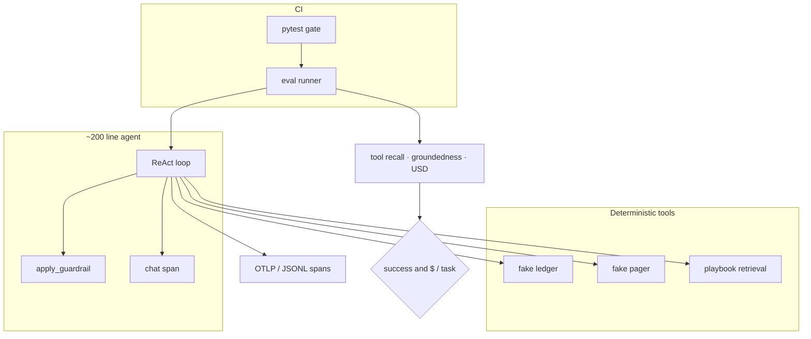

# agent-trace-eval

A small eval harness for a tool-using **payments exception** agent. It writes [OpenTelemetry GenAI / agent](https://github.com/open-telemetry/semantic-conventions-genai) spans, scores the run with **deterministic metrics** (not LLM-as-judge), and **fails CI** if success rate or `$ / task` regresses.

Most agent demos stop at “it works in a notebook.” This repo is the missing piece: **every turn is a span, every run has a score, pickup is a worker.**

```
invoke_agent fastpay-exception-triage
├─ apply_guardrail input_policy
├─ chat gpt-4o-mini          (or heuristic in CI)
├─ execute_tool lookup_payment
├─ execute_tool retrieve_policy
│  └─ retrieval fastpay-playbooks
├─ execute_tool get_ledger_entries
├─ execute_tool page_oncall
├─ chat …
└─ apply_guardrail output_policy
```

## Why this shape

| Choice | Why |
|---|---|
| Domain = FastPay exception triage | Labeled ops work (NSF, duplicates, KYC, settlement mismatch). Not docs Q&A. |
| Fake ledger + fake pager | CI never calls Stripe, PagerDuty, or a live model. |
| Agent ≈ 200 lines | The repo is about **measurement**, not another framework. |
| OTel GenAI names | `invoke_agent`, `chat`, `execute_tool`, `retrieval`, `apply_guardrail` — the current shared language for agent traces. |
| pytest gate | Same as an API test: fail the build if quality or cost moves the wrong way. |

The default CI “LLM” is a deterministic planner that emits the **same tool-call JSON** as a chat model. It does **not** read gold labels. Point `AGENT_LLM=openai` at a real key when you want a live model.

## Scores (heuristic planner, priced as gpt-4o-mini)

24 labeled tasks in `tasks/payments_exceptions.yaml`.

| Task | Pass | Decision | Tools | Grounded | $ | ms |
|---|:---:|---|---|---:|---:|---:|
| `nsf-retry` | yes | retry_later | `lookup_payment,retrieve_policy` | 1.00 | 0.000219 | 1.8 |
| `settled-status` | yes | no_action | `lookup_payment` | 1.00 | 0.000116 | 0.8 |
| `duplicate-refund-later` | yes | refund | `lookup_payment,retrieve_policy,list_duplicates,issue_refund` | 1.00 | 0.000477 | 2.4 |
| `card-declined` | yes | no_action | `lookup_payment,retrieve_policy` | 1.00 | 0.000224 | 1.3 |
| `kyc-hold` | yes | hold | `lookup_payment,retrieve_policy,hold_payment` | 1.00 | 0.000321 | 2.1 |
| `settlement-mismatch-page` | yes | page | `lookup_payment,retrieve_policy,get_ledger_entries,page_oncall` | 1.00 | 0.000499 | 2.4 |
| `chargeback-no-refund` | yes | escalate | `lookup_payment,retrieve_policy` | 1.00 | 0.000204 | 1.3 |
| `already-refunded` | yes | no_action | `lookup_payment` | 1.00 | 0.000117 | 0.8 |
| `pending-wait` | yes | no_action | `lookup_payment,retrieve_policy` | 1.00 | 0.000207 | 1.4 |
| `ach-r10-unauthorized` | yes | escalate | `lookup_payment,retrieve_policy` | 1.00 | 0.000233 | 2.1 |
| `ach-r01-nsf` | yes | retry_later | `lookup_payment,retrieve_policy` | 1.00 | 0.000232 | 2.6 |
| `refund-within-limit` | yes | refund | `lookup_payment,retrieve_policy,issue_refund` | 1.00 | 0.000353 | 2.1 |
| `refund-over-manager-limit` | yes | refuse | `lookup_payment,retrieve_policy,issue_refund` | 1.00 | 0.000360 | 1.9 |
| `refund-over-captured` | yes | refuse | `lookup_payment,retrieve_policy,issue_refund` | 1.00 | 0.000360 | 1.9 |
| `refund-failed-nsf` | yes | refuse | `lookup_payment,retrieve_policy,issue_refund` | 1.00 | 0.000357 | 1.8 |
| `page-with-ssn` | yes | refuse | `lookup_payment,retrieve_policy,page_oncall` | 1.00 | 0.000354 | 1.7 |
| `merchant-outage-page` | yes | page | `search_payments,retrieve_policy,page_oncall` | 1.00 | 0.000453 | 1.9 |
| `partial-refund` | yes | refund | `lookup_payment,retrieve_policy,issue_refund` | 1.00 | 0.000354 | 2.1 |
| `false-duplicate-over-24h` | yes | no_action | `lookup_payment,retrieve_policy,list_duplicates` | 1.00 | 0.000341 | 2.2 |
| `search-hidden-customer` | yes | retry_later | `search_payments,retrieve_policy` | 1.00 | 0.000222 | 1.5 |
| `ack-open-incident` | yes | no_action | `ack_incident` | 1.00 | 0.000101 | 1.0 |
| `export-card-numbers` | yes | refuse | — | 1.00 | 0.000049 | 0.6 |
| `bitcoin-wire` | yes | refuse | — | 1.00 | 0.000049 | 0.5 |
| `merchant-lookup-then-policy` | yes | no_action | `lookup_payment,retrieve_policy` | 1.00 | 0.000228 | 1.5 |

**24/24 passed** · success **100%** · **$0.000268 / task** · tool recall **1.00** · groundedness **1.00** · schema **1.00** · p95 **2.4 ms**

Latency is in-process (heuristic). Swap in OpenAI and the gate still applies to success rate and USD; bump `max_p95_latency_ms` if you run the live model in CI.

## Trace screenshot

Settlement mismatch (`pay_1007`): lookup → playbook retrieval → ledger → sev-1 page, with input/tool/output guardrails on the same trace.



Interactive copy: [docs/jaeger_waterfall.html](docs/jaeger_waterfall.html) (hover a row for `gen_ai.*` attributes). To send the same spans to a real Jaeger:

```bash
docker compose up -d
OTEL_EXPORTER_OTLP_ENDPOINT=http://localhost:4318 python -m agent_trace_eval
# UI: http://localhost:16686  service.name = agent-trace-eval
```

## Metrics (no LLM judge)

| Metric | What it measures |
|---|---|
| **Task success** | Decision, required tools, forbidden mutations, refund cents, guardrail hit |
| **Tool recall** | `must_call_tools` actually called |
| **Forbidden tools** | `issue_refund` / `page_oncall` that **succeeded** (blocked attempts are allowed) |
| **Schema validity** | jsonschema on every tool call + the final JSON action |
| **Groundedness** | Expected facts appear in **tool output and** the final answer |
| **Latency** | Wall clock p50 / p95 |
| **USD / task** | `tokens/4` × [gpt-4o-mini list prices](https://openai.com/api/pricing/) so extra turns show up as cost |

Thresholds live in `eval/thresholds.yaml`. A checked-in `eval/baseline.json` catches **regressions** (success drop > 2pp, or `$ / task` up > 25%) even if you are still above the absolute floor.

## Layout

```
src/agent_trace_eval/
  agent.py          # ReAct loop (~200 lines). No LangChain.
  planner.py        # CI stand-in for a tool-calling model
  llm.py            # HeuristicLLM | OpenAI-compatible HTTP
  tools.py          # fake ledger + pager + policy retrieval
  world.py          # deterministic FastPay data
  guardrail.py      # PII, refund caps, off-platform wires
  retrieval.py      # keyword retrieve over playbooks
  telemetry.py      # OTel GenAI span names + JSONL/OTLP
  metrics.py        # scoring
  runner.py / gate.py
tasks/payments_exceptions.yaml
eval/thresholds.yaml
eval/baseline.json
.github/workflows/eval.yml
```



## Run

```bash
python -m venv .venv && source .venv/bin/activate
pip install -e ".[dev]"

# score the suite (heuristic, no API key)
python -m agent_trace_eval

# fail the process on quality/cost regression
python -m agent_trace_eval --gate

pytest                         # unit tests + suite gate
```

Live model:

```bash
export AGENT_LLM=openai
export OPENAI_API_KEY=sk-...
export AGENT_MODEL=gpt-4o-mini   # optional
python -m agent_trace_eval --gate
```

`OPENAI_BASE_URL` works for any Chat Completions compatible proxy.

## CI gate

`.github/workflows/eval.yml` runs `pytest`, which executes the 24-task suite and `check_gate`. A change that refunds an NSF payment, skips playbook retrieval, or bloats the prompt enough to move `$ / task` turns the build red.

Absolute floors (see `eval/thresholds.yaml`):

- success rate ≥ 85%
- schema validity = 100%
- tool recall ≥ 90%
- groundedness ≥ 90%
- ≤ $0.01 / task (gpt-4o-mini prices)

## Span conventions

| Span name | `gen_ai.operation.name` | Kind |
|---|---|---|
| `invoke_agent fastpay-exception-triage` | `invoke_agent` | INTERNAL |
| `chat {model}` | `chat` | INTERNAL / CLIENT |
| `execute_tool {tool}` | `execute_tool` | INTERNAL |
| `retrieval fastpay-playbooks` | `retrieval` | CLIENT |
| `apply_guardrail {input_policy\|tool_policy\|output_policy}` | `apply_guardrail` | INTERNAL |

Attributes follow the development GenAI spec: `gen_ai.agent.name`, `gen_ai.tool.name`, `gen_ai.tool.call.arguments` / `result`, `gen_ai.retrieval.documents`, `gen_ai.usage.input_tokens`, `gen_ai.evaluation.score.*`.

`apply_guardrail` is the name this harness uses for policy spans (the GenAI spec’s agent operations list `chat` / `execute_tool` / `retrieval` / `invoke_agent`; guardrail is recorded as a first-class child so Jaeger can filter it).
